= Лабораторна робота №2

== Масиви. Функції. Рекурсія

=== Короткі теоретичні відомості
*Масиви у C&#43;&#43;*

Масив – це сукупність логічно взаємозв'язаних даних одного типу,
об'єднаних загальним ім'ям. Масив в С&#43;&#43; – це набір однотипних даних
(об'єктів), що мають загальне ім'я і що розрізняються місцеположенням в
цьому наборі (або індексом, який присвоюється кожному елементу масиву).
У програмі можуть бути масиви цілих чисел або чисел з плаваючою
точкою, символьні масиви і так далі.

*Опис одновимірного масиву*

Опис складається із специфікації типу, ідентифікатора і розмірності масиву. Звернення до елементів масиву виконується за їх індексами, які завжди починаються від нуля. Якщо, наприклад, оголосити в програмі масив на ім'я mas з 100 цілих чисел  `int mas[100];` то найперший елемент масиву отримує позначення `mas[0]`, наступний – `mas[1]` і так далі до останнього елемента `mas[99]`.
Так само можна оголосити масиви даних будь-яких інших типів:

[source,c++]
----
char c[20];  //Масив з 20 символів
float f[16];  	//Масив з 16 чисел з плаваючою точкою.
//Після оголошення масиву його можна заповнити числами, використовуючи індексний оператор [ ], наприклад:
int myArr[3];   // Оголошення масиву
myArr[0] = -12; // Ініціалізація першого елемента
// (його індекс дорівнює нулю) значенням –12
myArr[1] = 5;
myArr[2] = 37;
----

Доступ до окремих елементів масиву здійснюється також за допомогою індексного оператора:

[source,c++]
----
int result = myArr[0]  + myArr[1] + myArr[2];
----
Масив можна оголосити і заповнити одночасно, наприклад:
[source,c++]
----
int myArr[3]  =  { -12, 5, 37 } ;
----
Якщо розмірність задана, то число значень в списку ініціалізації не повинне її перевищувати.
Якщо розмірність масиву більше числа значень в списку, то елементи масиву, що не ініціалізували явно, будуть встановлені в 0, наприклад:
[source,c++]
----
int myArr[5]={ 0, 1, 2 }; //myArr буде дорівнювати { 0, 1, 2, 0, 0 }
----
За давнім стандартом, значення розмірності має бути константним виразом, тобто розмірність має бути відома на етапі трансляції. Це означає, що змінна не може використовуватися для завдання розмірності масиву.
Проте, сучасні версії компіляторів можуть дозволяти використовувати змінні у якості розміру масиву. Звичайно, при цьому не гарантується робота програми із використанням всіх компіляторів.
Якщо в масиві не дуже багато елементів і їх значення відомі заздалегідь, масив можна ініціалізувати разом з його оголошенням, уклавши перелік значень у фігурні дужки:
[source,c++]
----
int ns[10]={0,1,2,3,4,5,6,7,8,9};
----
Якщо ж масив великий, заповнити його доведеться програмно в циклі. Нехай ми хочемо утворити масив зі 100 елементів, заповнених натуральним рядом чисел. Це робиться таким чином:
[source,c++]
----
int mas[100];
for (int i=0;i<100;i++) mas[i]=i+1;
----
До елементів масиву можна звертатися і вибірково, наприклад
[source,c++]
----
test[50]=0x7FFA;
----

*Збереження одновимірних масивів*

У С&#43;&#43; одновимірний масив логічно зберігається як послідовність впорядкованих елементів в пам'яті. Кожен елемент відноситься до одного і того ж типу даних.

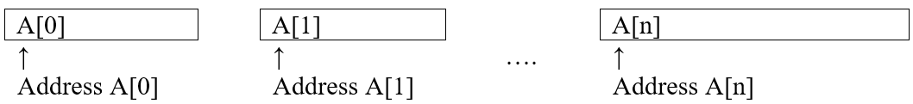

У С&#43;&#43; ім'я масиву є константою і розглядається як адреса першого елемента цього масиву. Так, в оголошенні `type A[arraySize];` ім'я масиву А є константою і визначає місцеположення в пам'яті першого елементу `A[0]`. Елементи `A[1]`, `A[2]` і т.д. слідують за ним послідовно.
Припустимо, що `sizeof(type) = M`, тоді весь масив `А` займає  `М * arraySize` байт.
Компілятор задає таблицю, названу дескриптором масиву, для ведення запису характеристик масиву.

*Символьні масиви*

Символьні масиви можуть становити набір окремих символів або зв'язний символьний рядок.
У першому випадку масив можна ініціалізувати так само, як і числовий, перерахуванням всіх його елементів:
[source,c++]
----
char cs[17]={'С','и','м','в','о','л','ь','н','и','й',' ',
'м','а','с','и','в'};
----
Такий масив займає в пам'яті точно 16 байт.
У другому випадку масив ініціалізувався символьним рядком:
[source,c++]
----
char cz[20] = "Символьний масив";
----
При такій ініціалізації компілятор записує в пам'ять в кінці рядка двійковий нуль, який є символом-обмежувачем. Багато функцій для роботи з рядками (наприклад, копіювання рядка або виведення рядка на екран) за цим символом визначають, де закінчується рядок. Це позбавляє нас від необхідності визначати і вказувати при виклику функції фактичну довжину рядка. Таким чином, масив займає в пам'яті на 1 байт більше, ніж в ньому є значущих символів. Цю обставину необхідно враховувати при завданні довжини масиву в його оголошенні, яка повинна вибиратися на одиницю більше максимально можливої довжини рядка.
Оголошення довжини символьного масиву із запасом доцільно лише в тих випадках, коли він заповнюватиметься програмно рядками різної довжини. Якщо ж даний текстовий рядок змінюватися не буде, зручніше оголосити її без рекомендації довжини, залишивши в оголошенні пару квадратних дужок, які скажуть компілятору, що змінна cz є не одиничним символом, а символьним масивом:
[source,c++]
----
char cz[] = "Символьний масив";
----
Компілятор, виділяючи пам'ять під цей масив, сам визначить його довжину, яка в даному випадку дорівнюватиме 17 байтам.

*Приклади операцій з лінійним масивом показані у наступній програмі:*
[source,c++]
----
#include <iostream>
#include <iomanip>
#include <stdlib.h>

#define N 10

using namespace std;
int main ()
{
    int m[N];

    // 1. Ініціалізація масиву нулями. ===========================
    for (int i = 0; i < N; i ++) m [i] = 0;
    // 2. Ініціалізація масиву випадковими числами ===============
    for (int i = 0; i < N; i ++) m [i] = rand()%11;
    // 3. Друк масиву в рядок. ===================================
    for (int i = 0; i < N; i ++) cout << setw(4) << m[i];
    cout << endl;
    // 4. Обчислення суми елементів масиву. ======================
    int sum = 0;
    for (int i = 0; i < N; i++) sum += m[i];
    cout << "Сума = " << sum << endl;
    // 5. Виведення елементів масиву у вигляді гістограми. =======
    cout << "Елемент" << setw(13) << "Значення" << setw(13)
                                  << "Гiстограма" << endl;
    for (int i = 0; i < N; i ++) {
        cout << setw(7) << i << setw(13) << m[i] << "..." ;
        for (int j = 0; j < m[i]; j++ ) cout << "*";
        cout << endl;
    }
    // 6. Сортування масиву методом "бульбашки". =================
    int temp;
    cout << "Початковий порядок елементiв" << endl;
    for (int i = 0; i < N; i ++) cout << setw(4) << m[i];
    cout << endl;
    // сортування
    for (int i = 0; i<N-1; i++ ) // ==============================
        for (int j = i; j<N; j++ )
            if (m[i]> m[j]) {
                temp = m[i]; m[i]= m[j]; m[j]= temp;
            }
    cout << "Масив пiсля сортування" << endl;
    for (int i = 0; i < N; i ++) cout << setw(4) << m[i];
    cout << endl;
    // 7. Лінійний пошук в масиві. ================================
    int key, flag = N;
    cout << "Введiть ключ пошуку" << endl;
    cin >> key;
    for (int i = 0; i < N; i ++) {
        if (m[i] == key ) {
            flag = i;
            cout << "Шуканий елемент має iндекс=" << i << endl;
        }
    }
    if (flag == N )
        cout << "Элемент не знайдений" << endl;
    // 8. Пошук максимального і мінімального елементів масиву. ====
    int max, min;
    max = min = m[0];
    for (int i = 1; i < N; i++) {
        if (m[i] > max) max = m[i];
        if (m[i] < min) min = m[i];
    }
    cout << "Максимальний елемент=" << max << endl;
    cout << "Мiнiмальний елемент =" << min << endl;
    // 9. Перестановка елементів масиву в зворотному порядку. =====
    for (int i = 0; i<(N/2); i++ ) {
        temp = m[i];
        m[i]=m[N-1-i];
        m[N-1-i]=temp;
    }
    // друк
    cout<< "Перестановка\n";
    for (int i = 0; i < N; i ++) cout << setw(4) << m[i];
    cout << endl;
    return 0;
}
----

Якщо запустити цю програму на виконання, результат може бут таким:

[source]
----
10  10   7   9   7   3   1   9   8   2
Сума = 66
Елемент     Значення   Гiстограма
      0           10...**********
      1           10...**********
      2            7...*******
      3            9...*********
      4            7...*******
      5            3...***
      6            1...*
      7            9...*********
      8            8...********
      9            2...**
Початковий порядок елементiв
  10  10   7   9   7   3   1   9   8   2
Масив пiсля сортування
   1   2   3   7   7   8   9   9  10  10
Введiть ключ пошуку
8
Шуканий елемент має iндекс=5
Максимальний елемент=10
Мiнiмальний елемент =1
Перестановка
  10  10   9   9   8   7   7   3   2   1

Process finished with exit code 0
----

*Функції в C&#43;&#43;*

_Функція – це іменована послідовність описів і операторів, що виконує яку-небудь закінчену дію. Функція може приймати параметри і повертати значення_.

Будь-яка програма на С++ складається з функцій, одна з яких повинна мати ім'я main (з неї починається виконання програми). Функція починає виконуватися у момент виклику. Будь-яка функція має бути оголошена і визначена.

Оголошення функції повинне знаходитися в тексті раніше її виклику для того, щоб компілятор міг здійснити перевірку правильності виклику.

Оголошення функції (прототип, заголовок, сигнатура) задає її ім'я, тип значення, що функція повертає і список параметрів.

Визначення функції містить, окрім оголошення, тіло функції, що є послідовністю операторів і описів у фігурних дужках:

[source]
----
[ клас ]  тип ім'я  ( [ список_параметрів ] ) {
      // тіло функції
}
----

Тип значення, яке повертає функція, може бути будь-яким, окрім масиву і функції (але може бути покажчиком на масив або функцію). Якщо функція не повинна повертати значення, вказується тип `void`.

Список параметрів визначає величини, які потрібно передати у функцію при її виклику. Елементи списку параметрів розділяються комами. Для кожного параметра, що передається у функцію, вказується його тип і ім'я (у оголошенні імена можна опускати).

У визначенні, в оголошенні і при виклику однієї і тієї ж функції типи і порядок слідування параметрів повинні збігатися.

На імена параметрів обмежень по відповідності не накладається, оскільки функцію можна викликати з різними аргументами, а в прототипах імена ігноруються компілятором (вони використовуються тільки для поліпшення читаності програми).

Функцію можна визначити як вбудовану за допомогою модифікатора `inline`, який рекомендує компілятору замість звернення до функції поміщати її код безпосередньо в кожну точку виклику. Модифікатор `inline` ставиться перед типом функції. Він застосовується для коротких функцій, щоб знизити накладні витрати на виклик (збереження і відновлення регістрів, передача управління). Директива `inline` носить рекомендаційний характер і виконується компілятором в міру можливості. Використання `inline` – функцій може збільшити об'єм виконуваної програми. Визначення функції повинне передувати її викликам, інакше замість `inline` – розширення компілятор згенерує звичайний виклик.

_Тип значення, що повертає функція і типи параметрів спільно визначають тип функції._

Для виклику функції в простому випадку потрібно вказати її ім'я, за яким в круглих дужках через кому перераховуються імена аргументів, що передаються. Виклик функції може знаходиться в будь-якому місці програми, де по синтаксису допустимий вираз того типу, який формує функція. Якщо тип значення, яке повертає функція не `void`, то вона може входити до складу виразу або, в окремому випадку, розташовуватися в правій частині оператора присвоювання.

Розглянемо приклад програми, що знаходить найменше з трьох чисел, використовуючи при цьому функцію `min3()`, викликаючи її за іменем.

[source,c++]
----
#include <iostream>

int min3(int x, int y, int z);

using namespace std;

int main() {
    int a,b,c;
    cin >> a >> b >> c;
    int x = min3(a,b,c);
    cout << "min = " << x << endl;
    return 0;
}

int min3(int x, int y, int z) {
    return x < y ? x < z ? x : z : y < z ? y : z;
}
----

При виконанні програми можна отримати такий результат:
[source]
----
4 7 3
min = 3

Process finished with exit code 0
----

*Особливості виконання функцій*

Усі величини, які описані усередині функції, а також її параметри, є локальними. Зоною їх дії є функція. При виклику функції, як і при вході в будь-який блок, в стеку виділяється пам'ять під локальні автоматичні змінні. Крім того, в стеку зберігається вміст регістрів процесора на момент, що передує виклику функції, і адресу повернення з функції для того, щоб після виходу з неї можна було продовжити виконання функції, яка її викликала.

При виході з функції відповідна ділянка стека звільняється, тому значення локальних змінних між викликами однієї і тієї ж функції не зберігаються. Якщо цього потрібно уникнути, при оголошенні локальних змінних використовується модифікатор `static` (проте, це робити не рекомендується).

*Значення, що повертається функцією*

Механізм повернення з функції у функцію, що викликала її, реалізується оператором
[source]
----
return [ вираз ];
----

Якщо функція описана як `void`, вираз не вказується. Оператор `return` використовується для дострокового виходу з функції.

Оператор `return` можна опускати для функції типу `void`, якщо повернення з неї відбувається перед закриваючою фігурною дужкою, і для функції `main`.

Вираз, вказаний після `return`, неявно перетвориться до типу повертаного функцією значення і передається в точку виклику функції.

Функція може містити декілька операторів `return` (це визначається потребами алгоритму).

*Обмін інформацією між функціями*

При спільній роботі функції повинні обмінюватися інформацією. Це можна здійснити:

- за допомогою глобальних змінних
- через параметри функції
- через значення, що повертає функція.

_Обмін інформацією за допомогою глобальних змінних_

Глобальні змінні видно у всіх функціях, де не описані локальні змінні з тими ж іменами, тому використовувати їх для передачі даних між функціями дуже легко. Проте, це не рекомендується, оскільки ускладнює відлагодження програми і перешкоджає розміщенню функцій в бібліотеки загального користування. Потрібно прагнути до того, щоб функції були максимально незалежні, а їх інтерфейс повністю визначався прототипом функції.

_Використання параметрів функції для обміну інформацією між функціями_

Механізм параметрів є основним способом обміну інформацією між функціями, що викликаються і викликають. Параметри, перераховані в заголовку опису функції, називаються формальними, а записані в операторі виклику функції – фактичними.

При виклику функції, насамперед, обчислюються вирази, що стоять на місці фактичних параметрів; потім в стеку виділяється пам'ять під формальні параметри функції відповідно до їх типу, і кожному з них привласнюється значення відповідного фактичного параметра. При цьому перевіряється відповідність типів і при необхідності виконуються їх перетворення. При невідповідності типів видається діагностичне повідомлення.

Існує два способи передачі параметрів у функцію: за значенням і за адресою.

При передачі за значенням в стек заносяться копії значень фактичних параметрів, і оператори функції працюють з цими копіями. Доступу до початкових значень параметрів у функції немає, а, отже, немає і можливості їх змінити.
При передачі за адресою в стек заносяться копії адрес параметрів, а функція здійснює доступ до елементів пам'яті по цих адресах і може змінити початкові значення параметрів.

[source, c++]
----
// Способи передачі параметрів у функцію
#include <iostream>
using namespace std;

void f(int i, int* j, int& k);
int main()
{
    int i = 1, j = 2, k = 3;
    cout << "i j k\n";
    cout << i << " " << j << " " <<  k << endl;
    f(i, &j, k);
    cout << i << " " <<  j << " " <<  k <<endl;
    return 0;
}

void f (int i, int* j, int& k)
{
    i++; (*j)++; k++;
}
----

Результат роботи програми
[source]
----
i j k
1 2 3
1 3 4

Process finished with exit code 0
----

Перший параметр (i) передається за значенням. Його зміна у функції не впливає на початкове значення.
Другий параметр (j) передається за адресою за допомогою покажчика, при цьому для передачі у функцію адреси фактичного параметра використовується операція взяття адреси, а для набуття його значення у функції потрібна операція розіменування.
Третій параметр (k) передається за адресою за допомогою посилання.

При передачі за посиланням, у функцію передається адреса вказаного при виклику параметра, а усередині функції всі звернення до параметра неявно "розіменуються". Тому використання посилань замість покажчиків покращує читабельність програми, позбавляючи від необхідності застосовувати операції отримання адреси і розіменування.

Використання посилань замість передачі за значенням ефективніше, оскільки не вимагає копіювання параметрів, що має значення при передачі структур даних великого об'єму.

Якщо потрібно заборонити зміну параметра всередині функції, використовується модифікатор `const`, наприклад:

[source, c++]
int f(const char*);

Рекомендується вказувати `const` перед всіма параметрами, зміна яких у функції не передбачається. Це полегшує відлагодження великих програм, оскільки по заголовку функції можна зробити висновок про те, які величини в ній змінюються, а які ні. Крім того, на місце параметра типу `const&` може передаватися константа, а для змінної при необхідності виконуються перетворення типу.

Таким чином, початкові дані, які не повинні змінюватися у функції, бажано передавати їй за допомогою константних посилань. За замовчуванням параметри будь-якого типу, окрім масиву і функції (наприклад, дійсного, структурного, перерахування, об'єднання, покажчик), передаються у функцію за значенням.

*Перевантаження функцій*
У мові C&#43;&#43; передбачена можливість створення декількох функцій з однаковим іменем. Це називається перевантаженням функцій. Перевантажені функції повинні відрізнятися одна від одної списками параметрів: або типом одного або декількох параметрів, або різною кількістю параметрів, або і тим і іншим одночасно. Розглянемо такий приклад:

[source, c++]
int  func(int, int);
int  func(long, long);
int  func(long);

Функція `func()` перевантажена з трьома різними списками параметрів. Перша і друга версії відрізняються типами параметрів, а третя – їх кількістю.

Типи значень, що повертають перевантажені функції, можуть бути однаковими або різними. Слід мати на увазі, що створення двох функцій з однаковим іменем і однаковим списком параметрів, але з різними типами значень, що повертаються, не дозволяється та призведе до помилки компіляції.

Припустимо, потрібно створити функцію, яка подвоює будь-яке отримане нею значення. При цьому хотілося б мати можливість передавати їй значення типу int, long, float або double. Без перевантаження функцій довелося б створювати чотири різні функції:

[source, c++]
int Doubleint(int);
long DoubleLong(long);
float DoubleFloat(float);
double DoubleDouble(double);

За допомогою перевантаження функцій можна використовувати такі  оголошення:

[source, c++]
int Double(int);
long Double(long);
float DouDle(float);
double Double(double);

Завдяки використанню перевантажених функцій не потрібно турбуватися про виклик в програмі потрібної функції, що відповідає типу змінних, які передаються. При виклику перевантаженої функції компілятор автоматично визначить, який саме варіант функції слід використовувати.

*Параметри функції, використовувані за замовчуванням*

Для кожного параметра, що оголошується в прототипі і визначенні функції, має бути передане відповідне значення у виклику функції.

Передаване значення повинне мати оголошений тип. Отже, якщо деяка функція оголошена як long func(int); то вона дійсно повинна набувати цілочисельного значення. Якщо тип оголошеного параметра не збіжиться з типом передаваного аргументу, компілятор повідомить про помилку.

З цього правила існує одне виключення, яке набуває чинності, якщо в прототипі функції для параметра оголошується стандартне значення. Це значення, яке використовується у тому випадку, якщо при виклику функції для цього параметра не встановлено ніякого значення. Дещо змінимо попереднє оголошення:

[source, c++]
long func(int  x = 50);

Прототип такого оголошення потрібно розуміти таким чином. Функція func(int) повертає значення типу long і приймає параметр типу int. Але якщо при виклику цієї функції аргумент наданий не буде, використовуйте замість нього число 50. А оскільки в прототипах функцій імена параметрів не обов'язкові, то останній варіант оголошення можна переписати по-іншому:

[source, c++]
long func (int = 50);

Визначення функції не змінюється при оголошенні значення параметра, що задається за замовчуванням. Тому заголовок визначення цієї функції виглядатиме так,  як і раніше:

[source, c++]
long func (int x);

Якщо при виклику цієї функції аргумент не встановлюється, то компілятор привласнить змінною х значення 50. Ім'я параметра, для якого в прототипі встановлюється значення за замовчуванням, може не збігатися з ім'ям параметра, що вказується у заголовку функції: значення, задане за замовчуванням, присвоюється за позицією, а не за іменем.

Установку значень за замовчуванням можна призначити будь-яким або всім параметрам функції. Але одне _обмеження_ все ж таки діє: _якщо якийсь параметр не має стандартного значення, то жоден з попередніх по відношенню до нього параметрів також не може мати стандартного значення_.

*Рекурсія*

Загалом, рекурсія значить самоповторюваний шаблон. У математиці це може бути функція визначена через себе. Інакше кажучи, це функція, що викликає сама себе. Кожна рекурсивна функція має умову завершення; інакше вона буде викликати себе безперестанку. Таку умову називають базовою умовою.

_Типи рекурсії_
Алгоритм рекурсії може бути реалізовним більш ніж одним способом. Можливі варіанти рекурсії це лінійна, хвостова, обопільна, двійкова і вкладена. Ви можете здійснити їх або під час компіляції через використання шаблонів або під час виконання через використання функцій.

_Лінійна рекурсія_

Лінійна рекурсія - це найпростіший вид рекурсії і, можливо, найуживаніша. У цієї рекурсії, одна функція просто викликає себе доти, доки не досягне умови завершення (також відомої як базова умова); цей процес відомий як намотування. Як тільки виконана умова завершення, виконання програми повертається до викликальника; це зветься розмотуванням.

Упродовж намотування і розмотування функція може виконувати якісь додаткові корисні задачі; у випадку факторіала вона множить вхідне значення на значення повернуте під час фази розмотування. Цей процес можна зобразити у вигляді такої діаграми, яка показує обидві фази функції обчислення факторіала із використанням лінійної рекурсії.

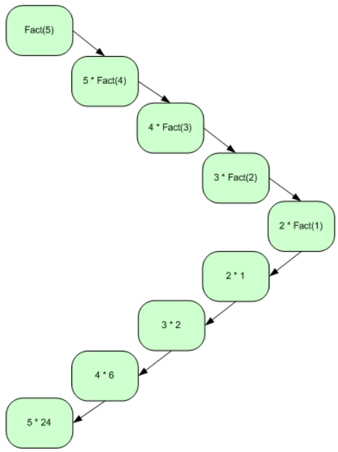

Математично, ви можете написати функцію обчислення факторіала таким чином; інакше кажучи, коли значення “n” нуль, повертати одиницю і, коли значення “n” більше ніж нуль, викликати функцію рекурсивно з “n-1” і помножити результат на “n”.

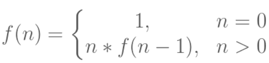

[source, c++]
----
int Factorial(int n)
{
  // умова завершення
  if (n == 0)
  return 1;

  // лінійний рекурсивний виклик
  return n * Factorial(n - 1);
}
----

Програма являє собою реалізацію лінійної рекурсії часу виконання. Тут ми маємо умову завершення у вигляді 0; програма починає виконувати розмотування коли досягає умови завершення.

_Хвостова рекурсія_

Хвостова рекурсія це спеціальна форма лінійної рекурсії, де рекурсивний виклик зазвичай іде останнім у функції. Цей тип рекурсії здебільшого більш ефективний, бо розумні компілятори автоматично перетворять таку рекурсію в цикл задля уникнення вкладених викликів функцій. Через те, що рекурсивний виклик функції зазвичай останнє, що робить функція, вона не має потреби ще щось робити під час розмотування; натомість, вона просто повертає значення отримане через рекурсивний виклик. Ось приклад тієї самої програми реалізованої як хвостова рекурсія.

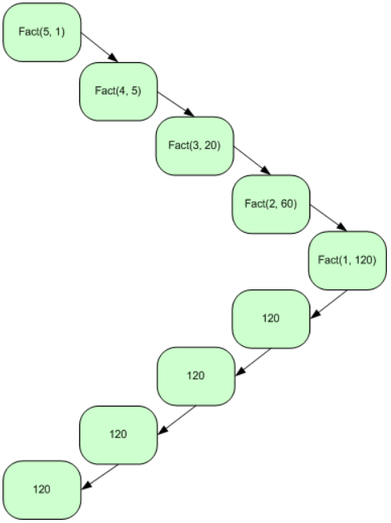

Ви можете визначити хвостову рекурсію математично через наступну формулу; інакше кажучи, коли значення “n” нуль, просто повернути значення “a”; якщо значення “n” більше ніж нуль, викликати рекурсивну функцію з параметрами “n-1” і “n*a”. Також, можна зауважити, що під час фази розмотування кожна рекурсивно викликана функція просто просто повертає значення “a”.

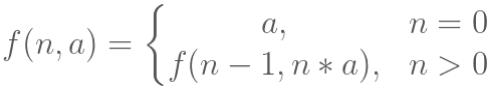

[source, c++]
----
int Factorial(int n, int a)
{
   // умова завершення
   if (n==0)
      return a;
   // хвостовий рекурсивний виклик
   return Factorial(n - 1, n * a);
}
----

Це змінена версія програми з лінійною рекурсією. Ви виконуєте всі обчислення до виклику рекурсивної функції, і просто повертаєте значення отримане з цього виклику. Тут, порядок обчислення зворотній до порядку за лінійної рекурсії. У випадку лінійної рекурсії, ви спочатку множите 1 на 2; отриманий результат на 3 і так далі. З іншого боку, тут ви множите n на n-1, і тоді на n-2 доки не досягнете 0

Хвостова рекурсія дуже корисна і часом неуникна в функціональних мовах програмування, бо деякі з них можуть не підтримувати циклічні конструкції. Тоді, зазвичай, цикли реалізуються за допомогою хвостової рекурсії. За допомогою хвостової рекурсії ви можете робити майже все, що можна зробити з циклом, але в зворотньому напрямку це часто не вірно. От дуже простий приклад, що демонструє цикл через хвостову рекурсію.

[source,c++]
----
// реалізація циклу через хвостову рекурсію
// проста версія
void RecursiveLoop(int n)
{
   // умова завершення
   if (n == 0)
      return;

   // дія
   cout << n << endl;

   // хвостовий рекурсивний виклик
   return RecursiveLoop(--n);
}
----

_Обопільна рекурсія_

Обопільна рекурсія також відома як непряма рекурсія. В цьому типі рекурсії, дві або більше функції викликають одна одну циклічно. Це єдиний шлях для здійснення рекурсії в мовах, що не дозволяють вам викликати функції рекурсивно. Умова завершення в такій рекурсії може бути в одній або всіх функціях.

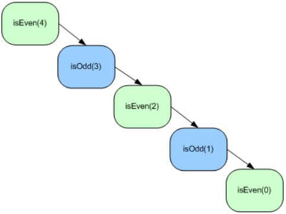

Математично, ви можете визначити ці функції як

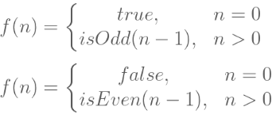

[source, c++]
----
bool isEven(int no)
{
   // умова завершення
   if (n == 0)
      return true;
   else
      // взаємний рекурсивний виклик
      return isOdd(n - 1);
}

bool isOdd(int n)
{
   // умова завершення
   if (n == 0)
      return false;
   else
      // взаємний рекурсивний виклик
      return isEven(n - 1);
}
----

Визначення парності числа за допомогою обопільної рекурсії не дуже добра ідея. Більш цікавим прикладом є чоловіча і жіноча послідовності. Обидві функції рекурсивно викликають одна одну і можуть представлені так.

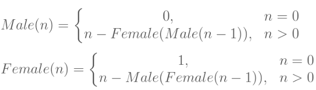
[source, c++]
----
int MaleSequence(int n)
{
   // умова завершення
   if (n == 0)
      return 0;

   // взаємний рекурсивний виклик
   return n - FemaleSequence(MaleSequence(n-1));
}

int FemaleSequence(int n)
{
   // умова завершення
   if (n == 0)
      return 1;

   // взаємний рекурсивний виклик
   return n - MaleSequence(FemaleSequence(n-1));
}
----

_Двійкова рекурсія_

У випадку двійкової рекурсії функція викликає себе двічі, замість одного разу. Такий тип рекурсії дуже корисний при роботі з деякими структурами даних, наприклад при обході дерева в прямому, зворотньому або центрованому порядку або генерації чисел Фібоначчі і так далі.

Двійкова рекурсія – це особлива форма експонентної рекурсії, де одна функція викликає себе більш ніж один раз (у випадку двійкової рекурсій).

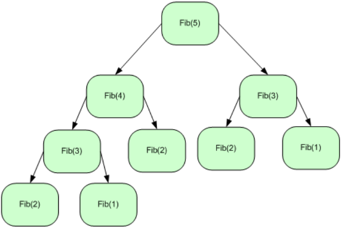

Математично ви можете визначити послідовність Фібоначчі як

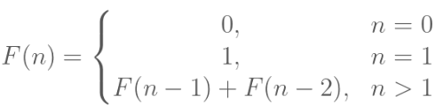

[source, c++]
----
int Fib(int n)
{
   // умова завершення
   if (n==0 || n==1)
      return n;

   // подвійний рекурсивний виклик
   return Fib(n - 1) + Fib(n - 2);
}
----

Ось проста реалізація послідовності Фібоначчі, що викликає рекурсивну функцію двічі. Тут ми маємо два базові випадкі; коли значення параметру на вході є 0 чи 1. Це, звісно, не найкраща реалізація послідовності Фібоначчі і ви можете перетворити її в хвостову рекурсію трошки змівнивши її.

[source, c++]
----
int Fib(int n, int a = 0, int b = 1)
{
// умова завершення
   if (n == 1)
      return b;
   else
      // хвостовий рекурсивний виклик
      return Fib(n-1, b, a+b);
}
----
Тут ви перетворюєте двійкову рекурсію в хвостову. Ви просто робите обчислення перед рекурсивним викликом; звідси, ви не маєте двічі робити рекурсивний виклик.

Математично це можна виразити як

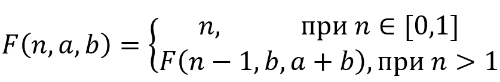

_Вкладена рекурсія_

Це особливий тип рекурсії, коли рекурсивні виклики вкладені. В усіх попередніх типах рекурсії, ви можете замінити рекурсію на простий цикл або цикл зі стеком, але цей тип рекурсії не може бути легко замінений на простий цикл.

Типовим прикладом вкладеної рекурсії є функція Акермана.

Математично функція Акермана може бути визначена як

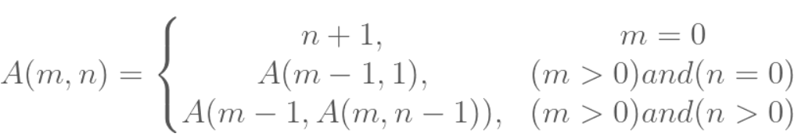

[source, c++]
----
int Ackermann(int m, int n)
{
   // умова завершення
   if (m == 0)
      return n + 1;

   // лінійний рекурсивний виклик
   else if (m > 0 && n == 0)
      return Ackermann(m-1, 1);

   // вкладений рекурсивний виклик
   else
      return Ackermann(m-1, Ackermann(m, n-1));
}
----

Ця функція має дві умови завершення; одна умова припиняє вкладені виклики і починає лінійну рекурсію; друга умова завершення припиняє лінійну рекурсію.

== Завдання
=== Завдання 2.1
Розв'язати задачу за посиланням.
До звіту включити код програми, результат виконання контрольного прикладу (зі сторінки задачі) та посилання на сторінку результату успішного проходження вашою програмою всіх тестів. Наприклад, для  задачі https://www.e-olymp.com/uk/problems/8975[] така сторінка може знаходитись за посиланням
https://www.e-olymp.com/uk/submissions/6963953

==== Варіант 1
https://www.e-olymp.com/uk/problems/7843[]

==== Варіант 2
https://www.e-olymp.com/uk/problems/7844[]

==== Варіант 3
https://www.e-olymp.com/uk/problems/914[]

==== Варіант 4
https://www.e-olymp.com/uk/problems/917[]

==== Варіант 5
https://www.e-olymp.com/uk/problems/928[]

==== Варіант 6
https://www.e-olymp.com/uk/problems/7831[]

==== Варіант 7
https://www.e-olymp.com/uk/problems/7832[]

==== Варіант 8
https://www.e-olymp.com/uk/problems/8959[]

==== Варіант 9
https://www.e-olymp.com/uk/problems/8961[]

==== Варіант 10
https://www.e-olymp.com/uk/problems/8962[]

==== Варіант 11
https://www.e-olymp.com/uk/problems/7833[]

==== Варіант 12
https://www.e-olymp.com/uk/problems/7848[]

==== Варіант 13
https://www.e-olymp.com/uk/problems/8680[]

==== Варіант 14
https://www.e-olymp.com/uk/problems/7845[]

==== Варіант 15
https://www.e-olymp.com/uk/problems/5059[]

==== Варіант 16
https://www.e-olymp.com/uk/problems/7845[]

==== Варіант 17
https://www.e-olymp.com/uk/problems/2238[]

==== Варіант 18
https://www.e-olymp.com/uk/problems/7537[]

==== Варіант 19
https://www.e-olymp.com/uk/problems/1952[]

==== Варіант 20
https://www.e-olymp.com/uk/problems/7834[]

=== Завдання 2.2
Програма, що розв'язує завдання 2.2 повинна вводити дані, викликати функцію, що виконує дію, описану в завданні та виводить результат (якщо іншого не вказано у явному вигляді). Для виконання дії, вказаної в умові, використовувати рекурсивну функцію. Використання циклів та рядкових функцій ЗАБОРОНЕНО.

==== Варіант 1
Дано натуральне число. Вивести його цифри у зворотному порядку різділяючи їх пробілами.

==== Варіант 2
Дано натуральне число. Вивести його цифри у прямому порядку різділяючи їх пробілами.

==== Варіант 3
Дано натуральне число n. Вивести натуральні числа від 1 до n.

==== Варіант 4
Дано натуральне число n. Вивести натуральні числа від n до 1.

==== Варіант 5
Дано два цілих числа a та b.
Виведіть всі цілі числа від A до B включно, в порядку зростання.

==== Варіант 6
Дано два цілих числа a та b.
Виведіть всі цілі числа від A до B включно, в порядку спадання.

==== Варіант 7
Дано натуральне число n.
Визначіть кількість його цифр.

==== Варіант 8
Дано натуральне число n.
Визначіть суму його цифр.

==== Варіант 9
Дано натуральне число n.
Визначіть кількість його непарних цифр.

==== Варіант 10
Дано натуральне число n.
Визначіть суму його парних цифр.

==== Варіант 11
Дано натуральне число n.
Визначіть суму його непарних цифр.

==== Варіант 12
Дано натуральне число n.
Визначіть кількість його парних цифр.

=== Завдання 2.3
Скласти програму обчислення наступних величин та виконати її у середовищі
програмування. Для розв'язання основної задачі (крім формування початкового масиву та введення-виведення) використовувати цикли ЗАБОРОНЕНО.
Елементи масива визначаються за формулою a[i] = p[i] – 64; де p[i+1] = (p[i] * 67 + 11) % 128. p[0] дорівнює n – номеру варіанта за списком групи,
кількість елементів у масиві дорівнює 50.

==== Варіант 1
Добуток найбільшого та найменшого елементів масиву a

==== Варіант 2
Сума елементів масиву a, значення яких двозначні парні числа

==== Варіант 3
Сума від'ємних елементів масиву, що діляться на 3

==== Варіант 4
Найбільший елемент масиву з непарним номером

==== Варіант 5
Найменший елемент масиву з парним номером

==== Варіант 6
Сума квадратів елементів масиву з парними номерами

==== Варіант 7
Сума елементів масиву a, значення яких кратні N

==== Варіант 8
Середнє арифметичне першого та найбільшого елементів масива

==== Варіант 9
Сума найбільшого та останнього елементів масива

==== Варіант 10
Сума елементів, що діляться на 3

==== Варіант 11
Половина суми елементів масиву з непарними номерами

==== Варіант 12
Кількість елементів масиву що діляться на 7

